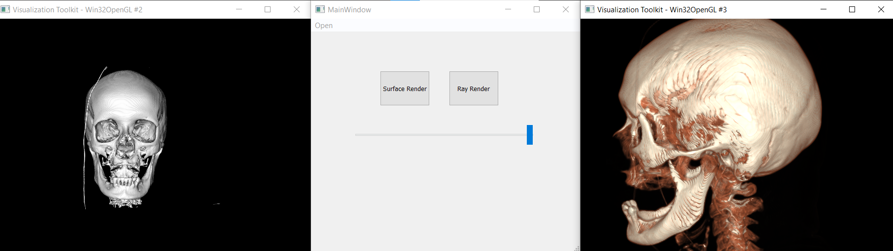

# Medical Visualization

##### This GUI consists of a menubar for opening a folder containing DICOM slices, 2 buttons, one for surface rendering and one for ray casting, and a slider for controlling the iso value. Decreasing the iso value increases skin density.

##### Surface rendering and Ray casting at iso value of 10.

##### Surface rendering and Ray casting at iso value of 500.

